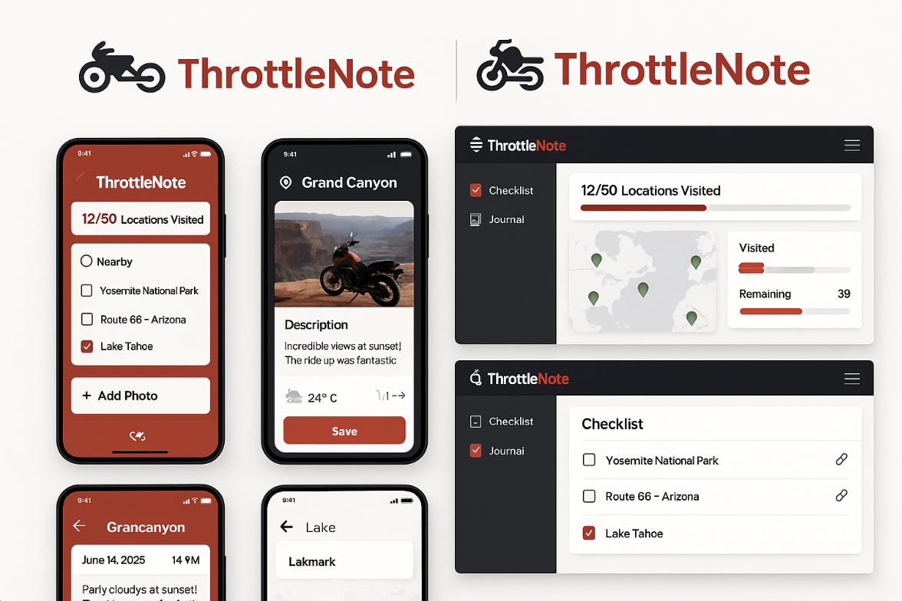

<p align="center">
  <a href="https://www.chromatic.com/">
    
  </a>
</p>

<h1 align="center">
  Throttle Note
</h1>

A motorcycle journaling app built with Spring Boot, React/React Native, and PostgreSQL. Track your rides, log your memories, mark locations as visited using GPS, and build your ultimate riding checklist.

## 🚅 Quick start

1.  **Create the application.**

    Visit [this repo](https://github.com/danielgithiomi/Throttle_Note_Frontend) to get this application locally.

    ```shell
    # Clone the template
    git clone https://github.com/danielgithiomi/Throttle_Note_Frontend
    ```

1.  **Install the dependencies.**

    Navigate into your new site’s directory and install the necessary dependencies.

    ```shell
    # Navigate to the directory
    cd <directory-name>/

    # Install the dependencies
    yarn / npm install
    ```

1.  **Open the source code and start editing!**

    Open the directory in your code editor of choice and launch it using:

    ```shell
    # For application
    npx expo start

    # For Storybook
    npm run storybook
    ```

## 🔎 Preview


